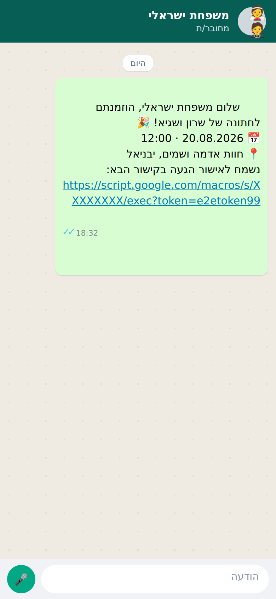
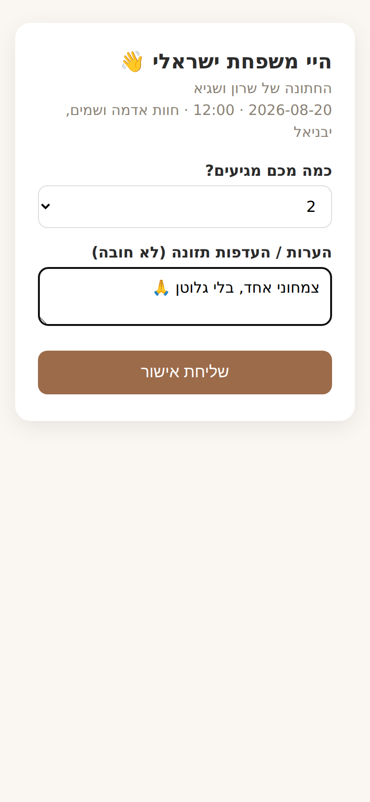
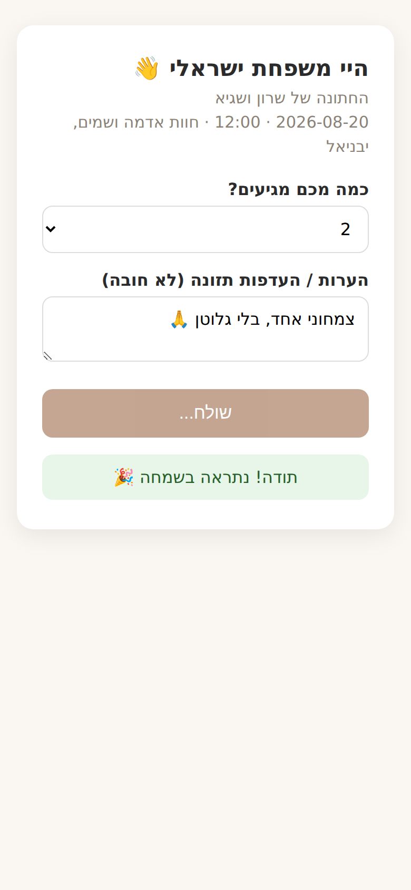

# 💍 Wedding Manager

A tiny, self-hosted wedding invitation + RSVP system. Hebrew / RTL first.
**No WhatsApp Business API, no Meta account, no per-message fees** — invites are
sent from your own WhatsApp through the Desktop app on your Mac, and RSVPs are
collected by a free Google Apps Script web form straight into a Google Sheet.

> Built for a real wedding. A handful of small files you can read in one
> sitting and actually debug.

---

## How it works

```
             ┌───────────────────────────┐
             │   Google Sheet (Guests)   │  ← your DB + live dashboard
             └─────────────┬─────────────┘
                           │  Apps Script (💍 menu)
       ┌───────────────────┼─────────────────────────┐
       ▼                   ▼                         ▼
 export invites /    import sent_log.csv       doGet / submitRsvp()
 reminders → CSV     (marks SENT / reminded)   (RSVP web app, free hosting)
       │                   ▲                         ▲
       ▼                   │                         │ personal link
 wedding-sender CLI ───────┘                         │
 (your Mac + WhatsApp Desktop) ──────► guest's phone ┘
```

1. Guest list lives in the Sheet. **ייצוא הזמנות** downloads a CSV of everyone
   who still needs an invite, each with their personal RSVP link.
2. On your Mac, `wedding-sender invite --csv invites.csv --live` opens
   WhatsApp Desktop chat-by-chat and sends a personalized Hebrew message
   (human-like random delays, resume-safe `sent_log.csv`, dry-run by default).
3. Paste `sent_log.csv` back into the Sheet (**ייבוא לוג שליחה**) — rows flip
   to `SENT`.
4. The guest taps their link → RTL form → the row flips to
   `CONFIRMED`/`DECLINED` with a headcount, live in your Sheet.
5. Reminders: same loop with **ייצוא תזכורות** and `wedding-sender reminder`.

## מה האורח רואה — what a guest sees

| The invite lands in WhatsApp | Their personal RSVP form | After confirming |
|:---:|:---:|:---:|
|  |  |  |

The whole flow, animated:


(A broken/expired link shows a polite [error screen](docs/media/rsvp-form-invalid.png).)

## Why this stack

| Need | How it's met |
|---|---|
| No WhatsApp Business API | Messages go out from **your own WhatsApp** via the Desktop app |
| Free | $0 — no Meta fees, no template approval, no hosting |
| No deployment headaches | The RSVP form runs inside Google (Apps Script web app) |
| Hebrew / RTL | RTL Sheet + `dir="rtl"` form + Hebrew message templates |
| Safe to run twice | Idempotent everywhere: sent log resume, import dedupe, PENDING→SENT guards |
| Debuggable | Plain JS + stdlib-only Python, one concern per file, fully tested |

## Repo structure

```
wedding-manager/
├── apps_script/            (deployed to Google via clasp; the Sheet side)
│   ├── Config.gs           (⚙️ wedding details + RSVP URL)
│   ├── Setup.gs            (one-time: create tabs)
│   ├── Guests.gs           (schema + token/link helpers)
│   ├── Export.gs           (CSV export for sending + sent-log import)
│   ├── ExportDialog.html   (download-CSV dialog)
│   ├── ImportDialog.html   (paste-sent-log dialog)
│   ├── Rsvp.gs             (RSVP web app: serve form + record)
│   ├── RsvpForm.html       (RTL Hebrew form)
│   ├── Menu.gs             (the 💍 menu + summary)
│   └── Budget.gs           (optional budget totals)
├── sender/                 (Python CLI, runs on your Mac; stdlib-only)
│   └── wedding_sender/     (phone, guests, templates, sentlog, desktop, cli)
├── tests/                  (pytest for the sender + node:test for the .gs logic)
├── e2e/                    (Playwright tests + demo-media generator for the form)
└── docs/                   (SETUP, SENDING, TEMPLATES, SHEET_SCHEMA + media/)
```

## Quick start

Full version in **[docs/SETUP.md](docs/SETUP.md)** and
**[docs/SENDING.md](docs/SENDING.md)**. The short version:

1. New Google Sheet → **Extensions → Apps Script** → push `apps_script/`
   with `clasp` (or copy-paste). Run `createSheets()`, fill in `Config.gs`.
2. **Deploy → Web app** (access: Anyone) → paste the `/exec` URL into
   `Config.gs` → `RSVP_BASE_URL` and push again.
3. Paste guests → menu **מילוי מזהים חסרים** → **ייצוא הזמנות לשליחה**.
4. On your Mac: `pip install ./sender`, then
   `wedding-sender invite --csv invites.csv` (dry run) → add `--live`.
5. Menu **ייבוא לוג שליחה** → paste `sent_log.csv` → watch RSVPs land.
   **סיכום אישורים** gives the live headcount.

## Testing

Everything that can run off-Google/off-Mac is tested:

```bash
pip install -e "sender[dev]" && pytest          # 43 unit tests: sender CLI, resume, phones…
npm ci && npm run test:gas                       # Apps Script logic in Node (export/import/RSVP)
npm run test:e2e                                 # real browser drives the RSVP form (Playwright)
npm run media                                    # regenerates docs/media/* (needs `pip install pillow`)
```

The GAS suite includes a **round-trip test**: the real Python package writes a
`sent_log.csv` and the real Apps Script import code consumes it — the CSV
contract can't silently drift. The only things not covered by CI are the two
real-world edges: an actual osascript send on macOS and the live Apps Script
deployment (manual checklist in the docs).

## Known limits / gotchas

- `whatsapp://` links prefill **text only**, so to send the invitation
  **graphic** the tool pastes it through the Desktop app: pass `--image
  invite.png` and the personalized message goes out as the image's caption
  (one message). Test with `--live --limit 1` first. (See docs/SENDING.md.)
- Sending from a personal account is rate-limited by WhatsApp's anti-spam
  heuristics: keep the built-in 20–45 s delays, send ≤ ~100/day, pilot with
  `--limit 3` first.
- The Mac must stay untouched while `--live` runs (the sender verifies
  WhatsApp is frontmost and aborts safely if you steal focus).
- Numbers without WhatsApp pop an error dialog in the Desktop app; the row
  still gets logged as sent — check the dialog, fix the number, delete the
  log row and rerun.

---

MIT licensed. Built to be forked — swap in your own wedding and go.
